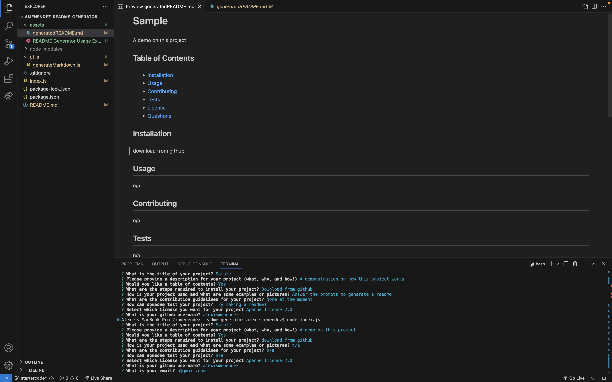

# README Generator
This project aims to streamline the process of making a readme by allowing a user to answers prompts, then have their answers automatically populate a README template. Documentation on projects is extremely important and this application makes it easier than ever to do so by cutting down the work required to make one in addition to streamlining the information to be easy to read and aesthetically acceptable. The biggest thing in this project was learning Node and NPM, in addition to passing information between files. It was very cool to see how you could take user input and generate a new file from that information into something usable for the user.

## Usage
 
[Example Video Link](https://drive.google.com/file/d/1YvDA-GJVqA3hM-3AWxAPzIgkjBLj53cu/view)

## Code Source
[Repository](https://github.com/alexismenendez/amenendez-readme-generator)

## Resources & Assets
Some starting code provided by EdX 
[Inquirer](https://www.npmjs.com/package/inquirer/v/8.2.4)